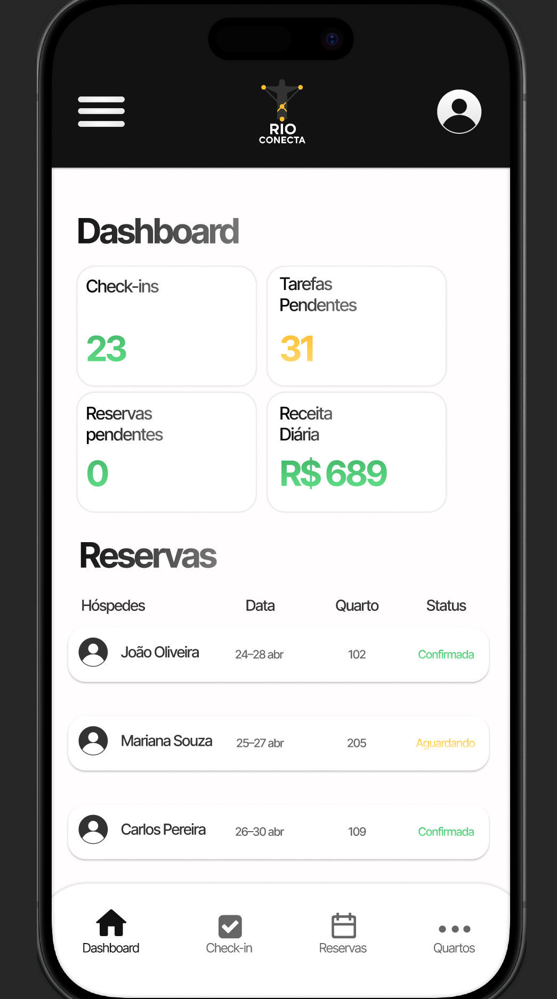

# Hotel Manager Mobile App - UI/UX Prototype

A prototype mobile application aimed at **small and medium-sized hotel managers**, helping to control:
- Check-ins and check-outs
- Room reservations
- Staff management
- Internal services (laundry, maintenance, extras)

> **Objective**: Centralize and simplify daily hotel management, saving time and 
> reducing operational errors through an intuitive interface.

## 🎨 Demo / Preview

> Click on the image to open the interactive Figma preview
> [🔗 Open on Figma]([https://www.figma.com/proto/SEU_LINK_AQUI](https://www.figma.com/proto/hsx5u15z2VB1HDS9RKDAQU/Rio-Conecta?node-id=3-232&p=f&t=0aeN0QNKUoEHxU4Q-1&scaling=min-zoom&content-scaling=fixed&page-id=0%3A1&starting-point-node-id=3%3A232))
